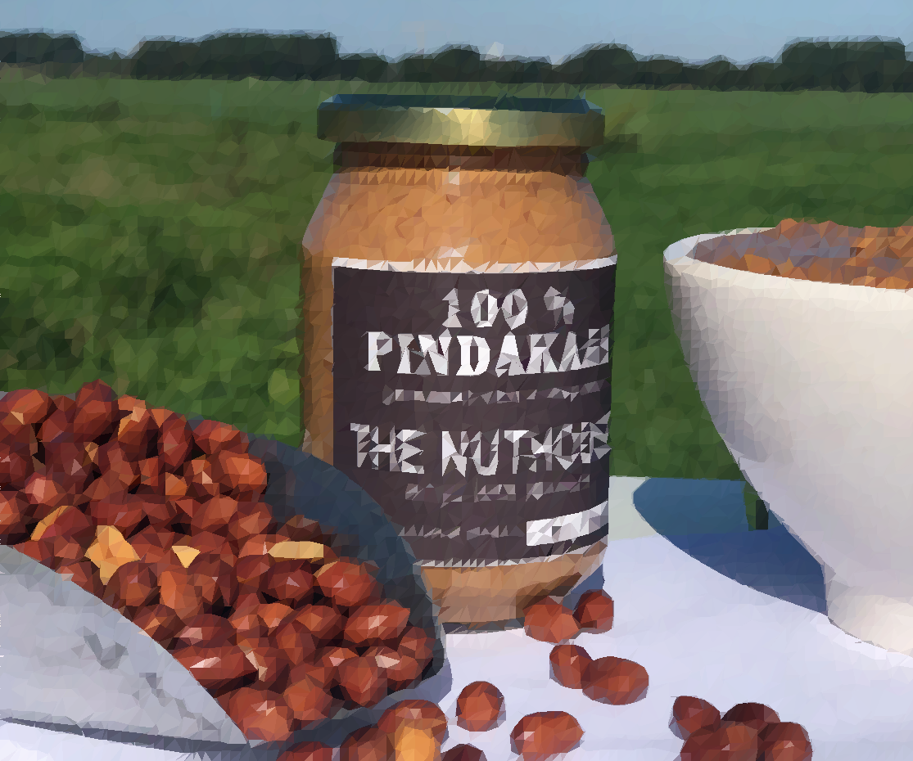

# LocalSearch
LocalSearch is a small piece of code to try and recreate pictures using triangles. It is made purely for fun, thus some things, like UI, might feel lacking. 

## How it works
The "algorithm", if you can call it that, works as follows. It consists of a startup phase, where the initial scene is created (or loaded) and a loop phase, where the scene is iterated over and enhanced. In the startup a grid is laid upon the source image, where every corned is called an anchor. Each square of the grid is sliced into two triangles (lower left to upper right diagonal). In every triangle the source image is sampled on four different spots and the average color of this sample is assigned to the triangle.
In the loop phase the algorithm iterates over the scene. Every iteration a random mutation is done, which is either a slight color change or a displacement of an anchor. After the mutation the algorithm checks to see if the current image is better than the previous, if so keep the change, if not undo the mutation. This is done a specified amount of rounds. After these the scene is saved in a JSON file and the final picture is saved as a PNG.

*An example image after 500.000 iterations*


## Getting started
The code in its current state is good to go, but it will overwrite the example image. To continue on the current image, change this code:
```Go
// Create a new scene
scene := st.NewTriangleSceneHeadstart(AnchorsWidth, AnchorsHeight, &original)

// // Open a saved scene
// scene := *structures.LoadTriangleScene(fmt.Sprintf("saves/%v_save.json", name))
```
To this:
```go
// // Create a new scene
// scene := st.NewTriangleSceneHeadstart(AnchorsWidth, AnchorsHeight, &original)

// Open a saved scene
scene := *structures.LoadTriangleScene(fmt.Sprintf("saves/%v_save.json", name))
```

To start on a new image, place a (24 or 32 bit) PNG (JPEG might work, never tested) in the pictures folder and change the `main` function to this:

```go
func main() {
	singleThreaded("NameOfFile", nil)
}
```

When finished the triangle version can be found in the same folder as `Triangle_NameOfFile.png` and the saved scene can be found in the saves folder as `NameOfFile_save.JSON`. 

The amount of iterations can be set with `RoundsPerWave`
Multiple images can be run in parallel using `parallelPictures(img1, img2 ... )`.
One image can be done on one (`singleThreaded(img)`) or multiple (`multiThreaded(img)`) threads (goroutines to be precise). Note that the multithreading is by far a proper algorithm, it serves merely as a base to create one.
The width and height of the scene are always the same as the source, however the amount of anchors can be set using `AnchorsWidth` and `AnchorsHeight`.

## Some notes:
The fitness function is the absolute function, this is probably not the best way to check for resemblance between pictures, but it sure is the fastest.
There are different ways to check for fitness, either a square or a single triangle, this hugely increases performance, but cuts down on modularity of the code.
There is some commented code for a CPU profiler and old schemes of the CPU profiles, in case you want to optimize it further.

